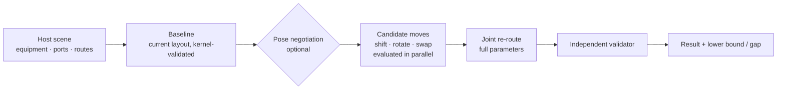

<div align="center">

# layout-kernel

**A computational kernel for automatic equipment and piping layout**

Equipment placement · 3D orthogonal pipe routing · negotiated congestion resolution · equipment move / rotate / tee-port-swap optimization · lower bounds & gaps · independent validator

**English** · [简体中文](README.zh-CN.md)

[](LICENSE)
[](pyproject.toml)
[](tests)
[](docs/guide.en.md)
[](src/layout_kernel/astar_fast.py)

</div>

---

## Documentation

| Document | Contents |
|---|---|
| 📘 [**User guide**](docs/guide.en.md) ([简体中文](docs/guide.md)) | Every public interface: the three entry points, each request and result field, errors and exit codes, calling from Python / Node / a browser, applying results, tuning, troubleshooting, and a case study |
| 📐 [Contract](docs/contract.md) (Chinese) | Field-level definition of the task file and result, the objective, the constraint registry, solver parameters |
| 🧮 [Model](docs/model.md) (Chinese) | Derivation of the mathematical model |
| ▶️ [Scene example](examples/scene/) | A runnable `request.json` plus `run_scene.py` (moving a sensor cuts bends from 4 to 2) |
| ▶️ [Routing example](examples/minimal_routing.py) | Calls the router and validator directly, with every parameter commented |
| ▶️ [Task-file example](examples/case_small_plant.json) | A complete place-and-route task file |

## Why

| | |
|---|---|
| 🎛️ **Every constraint is caller-configured** | 13 constraints, each with an explicit on/off switch and parameters. Nothing is hard-coded and there are no defaults: a missing setting is an error. |
| ✅ **The validator is the source of truth** | Reported violations and metrics come from a geometry-only validator that is independent of the solver's internal state. |
| 📉 **Heuristic, with a lower bound** | Returns a feasible, good layout plus the maximum gap to a lower bound at the final equipment positions. This is not an optimality proof, and the docs say so. |
| 🔌 **Plugs into existing projects** | The scene interface takes the host project's equipment instances, ports, poses and current routes, and returns route polylines, equipment offsets and orientations. |

## How it works



- **Single-pipe routing**: A\* on a grid (numba-compiled, and identical case by case to a pure-Python reference). The search state tracks direction, straight run length and the number of elevation changes. Multiple starts and goals are supported, which lets one search choose between candidate poses.
- **Multi-pipe negotiation**: PathFinder-style congestion pricing, run in parallel worker processes with a shared congestion map. A final cleanup pass re-routes each clashing pipe with all others held as hard obstacles.
- **Pose negotiation**: when pipes at the same node pick different poses, the disagreement is priced like congestion, round after round, until the pipes agree.
- **Equipment moves**: line-straightening, single alignment and re-orientation. Candidates are evaluated in parallel, and a batch of mutually independent improvements is accepted at once. A time limit is respected.

## Install

Python 3.11+. Use a dedicated virtual environment (`ortools` upgrades `protobuf`, which can clash with other projects):

```bash
python -m venv .venv
.venv/Scripts/python -m pip install "layout-kernel @ git+https://github.com/66-zhimeng/layout-kernel"
# development: git clone, then pip install -e ".[test,plot]"
```

Dependencies: numpy, scipy, numba, ortools (CP-SAT), networkx.

## Three ways to use it

<details open>
<summary><b>1. Task file: place + route, or route only</b></summary>

```python
from layout_kernel import solve

if __name__ == "__main__":                       # placement uses multiprocessing
    result = solve("examples/case_small_plant.json")
    print(result["ok"], result["metrics"])
```

```bash
layout-kernel examples/case_small_plant.json -o plan.json
```

Set `task.mode` to `place_and_route` (find equipment positions and pipes) or `route_only` (positions are given). The fields are described in [docs/contract.md](docs/contract.md) (in Chinese).
</details>

<details>
<summary><b>2. 3D scene: integrate with an existing project</b></summary>

```bash
layout-kernel-scene < examples/scene/request.json > result.json
python examples/scene/run_scene.py            # the same example from Python
```

The request holds nodes (bounding boxes, ports for each candidate pose), routes (ends, current bends, outer diameter, straight necks) and settings (constraints, weights, time limit, and so on). The result holds new route polylines, equipment `offsets`, re-oriented nodes in `orientations`, and the lower bound and gap. Every field, and how to call the kernel from other languages, is in [user guide §4](docs/guide.en.md#4-entry-a-3d-scene-interface).
</details>

<details>
<summary><b>3. Call the router directly</b></summary>

```python
from layout_kernel import routing as rt

sc = rt.Scene(DEVICES, NETS, ROUTING, WEIGHTS, SCALE)   # ROUTING includes "constraints"
routes, history, G = rt.negotiate(sc)
viol, metrics = rt.check_routes(sc, routes)
```

A runnable, fully commented example is in [examples/minimal_routing.py](examples/minimal_routing.py).
</details>

## Constraint switches

| Constraint | Meaning |
|---|---|
| `pipe_pipe_clearance` | Clearance between the outer walls of different pipes |
| `pipe_equipment_clearance` | Clearance between pipes and equipment boxes |
| `self_clearance` | Clearance between distant segments of the same pipe |
| `height_change_limit` | Maximum number of elevation changes per branch |
| `ceiling` | Maximum top-of-pipe elevation |
| `service_zones` | No pipes below maintenance zones |
| `straight_lengths` | Minimum straight runs between fittings |
| `low_pipes` | Centerline height limit for low-level pipes |
| `junction_merge_exemption` | Two pipes meeting at the same tee don't clash near its ports (applies only to that pair) |
| `internal_spools` | Tee internals and oblique stubs block other pipes |
| `equipment_spacing` | Equipment spacing when moving equipment |
| `equipment_keepout` | Equipment keep-out zones |
| `pipe_keepout` | Pipe keep-out zones |

Every constraint must state `"enabled": true/false`. Parameters and the meaning of "off" are in the contract doc.

## On a real project

In a Three.js piping-network web app (230 pipes, 183 nodes), every kernel result must also pass the app's own solid-geometry validation before it is applied:

| Scenario | Result | Time |
|---|---|---|
| Global, `seconds` = 120 | bends 454 → 330, length 2173 → 2089 m, 1.2% from the lower bound | ≈ 130 s |
| Global, `seconds` = 60 | bends 454 → 380, 1.9% from the lower bound | ≈ 70 s |
| Local (3 sensors) | bends 464 → 458, gap 0% | ≈ 7 s |

> The gap is computed at the final equipment positions and orientations: each pipe's shortest route on its own, summed. It is not a global bound over equipment that can still move. Parallel negotiation varies slightly from run to run.

## Modules

| Module | Role |
|---|---|
| `constraints.py` | Constraint registry and config validation |
| `routing.py` | Grid, A\*, tees, negotiated routing, pose negotiation, cleanup, independent validator |
| `astar_fast.py` | numba A\* for a single pipe (multi-start / multi-goal) |
| `scene.py` / `scene_cli.py` | 3D scene interface: per-pipe diameter and necks, oblique stubs, fixed routes, move / rotate / swap optimization, lower bound |
| `placement_sp.py` / `placement_cpsat.py` | Block placement (sequence pair + LP + parallel annealing / CP-SAT) and placement validation |
| `blocking.py` | Equipment → blocks: module detection, intra-module arrangement, clustering |
| `api.py` / `contract.py` / `build.py` | Task-file API, contract validation, glue |
| `coarse_route.py` | Coarse-grid routing (feasibility in seconds) |

## Tests

```bash
.venv/Scripts/python -m pytest -q        # 66 tests
```

## Limitations

- Pipes follow grid lines (the spacing is configurable). With mixed diameters, occupancy conservatively uses the largest diameter, and pipe sections are treated as squares.
- Placement is planar. In scene optimization equipment only translates, and orientations are picked from the candidates the caller supplies.
- Heuristic. The lower bound holds only for the final equipment positions, and none is given for multi-terminal nets.

## Related

The research history (model derivation, experiments, failures) lives in [math-problem-discussions](https://github.com/66-zhimeng/math-problem-discussions).

## License

[Apache-2.0](LICENSE)
