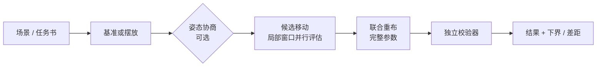

<div align="center">

# layout-kernel

**设备与管道自动排布的计算内核**

设备摆放 · 三维正交布管 · 多管协商消冲突 · 设备平移 / 旋转 / 三通换口优化 · 下界与差距 · 独立校验器

[English](README.md) · **简体中文**

[](LICENSE)
[](pyproject.toml)
[](tests)
[](docs/guide.md)
[](src/layout_kernel/astar_fast.py)

</div>

---

## 文档

| 文档 | 内容 |
|---|---|
| 📘 [**操作说明**](docs/guide.md)（[English](docs/guide.en.md)） | 全部开放接口：三个入口的调用方式、请求与结果的每个字段、错误与退出码、从 Python / Node / 浏览器调用、施加结果、调参、排错、接入实例 |
| 📐 [契约](docs/contract.md) | 任务书与方案的字段级定义、目标函数、约束注册表、求解参数 |
| 🧮 [数学模型与方法](docs/model.md)（[English](docs/model.en.md)） | 问题定义、约束、目标函数，以及摆放、布管、协商、下界各步的方法与证明边界 |
| ▶️ [场景示例](examples/scene/) | 可直接运行的请求 `request.json` 与脚本 `run_scene.py`（移动传感器，弯头 4 → 2） |
| ▶️ [布管示例](examples/minimal_routing.py) | 直接调用布管器与校验器，每个参数都有注释 |
| ▶️ [任务书示例](examples/case_small_plant.json) | 摆放 + 布管的完整任务书 |

## 为什么用它

| | |
|---|---|
| 🎛️ **约束全部由调用方配置** | 13 条约束，每条都有开关和参数，必须显式写出。内核不写死约束，也不设默认值，缺了直接报错。 |
| ✅ **结果以校验器为准** | 返回的违规和指标都来自只看几何的独立校验器，不依赖求解器内部数据。 |
| 📉 **启发式求解，附下界** | 给出可行且较优的方案，并报告在最终设备位置下离下界的最大差距。这不是最优性证明，文档里说清楚了。 |
| 🔌 **可接入已有项目** | 场景接口直接使用调用方的设备实例、端口、姿态和现有管路，返回管路折点、设备平移和朝向。 |

## 数学模型与方法

完整推导与每一步的细节见 [docs/model.md](docs/model.md)，下面是要点。

### 问题

给定有体积、有端口的设备和它们之间的连接，内核要决定两件事：设备的位置和朝向，以及每条连接的正交管路（只沿 ±X、±Y、±Z 走，只用 90° 弯头，多端点连接用三通）。

**决策变量**：

| 变量 | 任务书形式 | 场景形式 |
|---|---|---|
| 设备位置 | 平面网格点 (x_i, y_i) | t_i = t_i⁰ + Δ_i，每轴 \|Δ_i\| ≤ r |
| 设备朝向 | 绕竖直轴 0° / 90° / 180° / 270° | 在调用方给出的候选姿态中选（旋转、三通换向、同向口交换） |
| 管路 Γ_e | 端口之间的正交折线；多端点时是正交 Steiner 树 | 同左 |

**目标**（全部由校验器按实际几何计算）：

$$
J = w_A\frac{A}{A_0} + w_L\frac{L}{L_0} + w_B\frac{N_{\text{bend}}}{B_0} + w_C\frac{N_{\text{layer}}}{C_0}
$$

- A：设备和管道的 XY 外接矩形面积，长宽比补足到 κ；
- L：管道中心线总长；
- N_bend：90° 弯头数；
- N_layer：高度变化次数，两个相邻水平段高差超过 ε_z 记一次。

每根管可以设自己的权重倍数。

**约束**（13 条，每条可开关）：

- 正交走管、端口沿法向进出；
- 最短直管：弯头—弯头 ≥ 2ρ + ℓ_min，端口—弯头 ≥ ρ + ℓ_min，ρ = c_ρ·D；
- 净距：管—管 ≥ δ_pp，管—设备 ≥ δ_ep，同一根管相隔较远的两段 ≥ δ_pp；
- 高度变化 ≤ K、顶棚、低位管高度、检修区、禁区、设备间距；
- 三通内部短管是其他管的障碍。汇合于同一三通的管，只在彼此之间于口附近豁免。

### 方法

| 步骤 | 方法 | 性质 |
|---|---|---|
| 分块 | 识别刚性模块（并联阵列、链式模块）、CP-SAT 求模块内部排法、按连接聚簇 | 启发式 |
| 摆放 | **序列对** (Γ⁺, Γ⁻) 表示相对位置 → 最长路求最小外接尺寸 → **LP（HiGHS）** 定坐标，目标是面积切平面加管道下界 → 多进程**模拟退火**；另有 **CP-SAT** 精确模型 | 启发式；管道下界已证明 |
| 摆放阶段的管道下界 | 两端点：长度 ≥ max(\|p−q\|₁, 2ℓ_min + \|s_p−s_q\|₁)，弯头 ≥ 0/1/2（按方向关系）；多端点：k·ℓ_min + 伸出点坐标跨度之和 | 已证明是下界 |
| 布管网格 | 非均匀三维轨道网格：基础间距 ∪ 端口坐标 ∪ 膨胀后的障碍边界 | — |
| 单管 | **A\***，状态 = (节点, 方向, 上一个管件类型, 高度变化次数, 是否已有水平段, 直管长度)；可采纳启发式 = c_L·曼哈顿距离 + c_B·至少还需的弯头数；支配剪枝；numba 编译；支持多起点、多终点 | 不加权、放宽自身净距时，单管在网格上精确最优 |
| 多端点 | 先连最近的两个端点，其余端点就近接到树的直管段内部或弯头延长线上（弯头变三通） | 启发式 |
| 多管 | **PathFinder 协商**：边代价 c_L·len·(1+h_e)·(1+π·n_e)，冲突边累积历史代价 h_e，压力 π 逐轮放大；多进程乐观并发，共享占用表 | 启发式 |
| 清理 | 冲突 X–Y 依次试：只重布 X / 只重布 Y / 先 X 后 Y / 先 Y 后 X，其他管作为硬障碍 | 启发式；区分“确实无路”与“超上限” |
| 设备移动 | 以现有布局为基准；候选有串联拉直、单个对齐、整串靠拢、换姿态；每个候选在**局部窗口**内重布相关的管，多进程并行评估；互不相干的改进一批接受 | 启发式 |
| 姿态协商（可选） | 候选姿态做成虚拟节点，多起点、多终点 A\* 同时选两端姿态；同一节点上的姿态分歧像拥堵一样逐轮加价，直到一致 | 启发式 |
| 下界与差距 | 最终姿态下，各两端点管单独求精确最短路之和 LB；gap = (cost − LB)/cost | 在最终姿态下是有效下界 |

**独立校验器**只看折线几何，检查全部约束并计算 J；所有结果的 `ok`、违规和指标都来自它。



## 安装

需要 Python 3.11+。建议装在独立虚拟环境里（`ortools` 会升级 `protobuf`，可能与其他项目冲突）：

```bash
python -m venv .venv
.venv/Scripts/python -m pip install "layout-kernel @ git+https://github.com/66-zhimeng/layout-kernel"
# 开发：git clone 后 pip install -e ".[test,plot]"
```

依赖：numpy、scipy、numba、ortools（CP-SAT）、networkx。

## 三种用法

<details open>
<summary><b>1. 任务书：摆放 + 布管，或只布管</b></summary>

```python
from layout_kernel import solve

if __name__ == "__main__":                       # 摆放用多进程，必须放在这里
    result = solve("examples/case_small_plant.json")
    print(result["ok"], result["metrics"])
```

```bash
layout-kernel examples/case_small_plant.json -o 方案.json
```

`task.mode` 选 `place_and_route`（求设备位置和管道）或 `route_only`（设备位置已给定）。字段见 [docs/contract.md](docs/contract.md)。
</details>

<details>
<summary><b>2. 三维场景：接入已有项目</b></summary>

```bash
layout-kernel-scene < examples/scene/request.json > result.json
python examples/scene/run_scene.py            # 同一个示例的 Python 写法
```

请求里是节点（包围盒、各候选姿态下的端口）、管路（端点、现有折点、外径、直颈）和设置（约束、权重、时间上限等）。结果里是新的管路折点、设备平移 `offsets`、换了姿态的节点 `orientations`，以及下界与差距。每个字段的说明和从其他语言调用的写法见 [操作说明第 4 节](docs/guide.md#4-入口-a三维场景接口接入已有项目)。
</details>

<details>
<summary><b>3. 直接调用布管器</b></summary>

```python
from layout_kernel import routing as rt

sc = rt.Scene(DEVICES, NETS, ROUTING, WEIGHTS, SCALE)   # ROUTING 含 constraints
routes, history, G = rt.negotiate(sc)
viol, metrics = rt.check_routes(sc, routes)
```

可运行示例见 [examples/minimal_routing.py](examples/minimal_routing.py)，每个参数都有注释。
</details>

## 约束开关

| 约束 | 含义 |
|---|---|
| `pipe_pipe_clearance` | 不同管外壁之间的净距 |
| `pipe_equipment_clearance` | 管与设备包围盒的净距 |
| `self_clearance` | 同一根管沿管长相隔较远的两段之间的净距 |
| `height_change_limit` | 每条支路高度变化次数上限 |
| `ceiling` | 管顶最高标高 |
| `service_zones` | 检修区下方不得走管 |
| `straight_lengths` | 管件之间的最短直管 |
| `low_pipes` | 低位管的中心线高度上限 |
| `junction_merge_exemption` | 汇合于同一三通的两根管在口附近不算冲突（只对这两根管成立） |
| `internal_spools` | 三通内部短管、斜支口斜段是其他管的障碍 |
| `equipment_spacing` | 移动设备时的设备间距 |
| `equipment_keepout` | 设备禁区 |
| `pipe_keepout` | 管道禁区 |

每一条都要显式写 `"enabled": true/false`；参数和关闭时的含义见契约文档。

## 大规模实例上的表现

一个真实机房管网：230 根管、183 个节点（设备、三通、阀门、传感器），12 进程：

| 场景 | 结果 | 用时 |
|---|---|---|
| 全局优化，设 120 s | 弯头 454 → 330，管长 2173 → 2089 m，离下界 1.2% | 约 130 s |
| 全局优化，设 60 s | 弯头 454 → 380，离下界 1.9% | 约 70 s |
| 局部（3 个传感器） | 弯头 464 → 458，差距 0% | 约 7 s |

> 差距是在最终设备位置和朝向下计算的，各管单独求最短路后相加。它不是设备也能移动时的全局下界。并行协商每次结果略有不同。

## 模块

| 模块 | 作用 |
|---|---|
| `constraints.py` | 约束注册表与配置校验 |
| `routing.py` | 网格、A\*、三通、协商布线、姿态协商、清理、独立校验器 |
| `astar_fast.py` | 单管 A\* 的 numba 实现（多起点 / 多终点） |
| `scene.py` / `scene_cli.py` | 三维场景接口：每管管径与直颈、斜支口、固定管路、设备平移 / 旋转 / 换口优化、下界 |
| `placement_sp.py` / `placement_cpsat.py` | 块级摆放（序列对 + LP + 并行退火 / CP-SAT）与摆放校验 |
| `blocking.py` | 设备 → 块：模块识别、模块内部排法、聚簇 |
| `api.py` / `contract.py` / `build.py` | 任务书接口、契约校验、模块间的粘合 |
| `coarse_route.py` | 粗网格快速布管（秒级判断能否布下） |

## 测试

```bash
.venv/Scripts/python -m pytest -q        # 66 个
```

## 已知限制

- 管道只走网格线（间距可配置）；管径不同时，占用计算按最大管径保守处理，管截面按正方形算。
- 摆放只在平面内；场景优化中设备只做平移，朝向在调用方给出的候选朝向里选。
- 启发式求解；下界只针对最终设备位置，多端点管网不给下界。

## 许可

[Apache-2.0](LICENSE)
