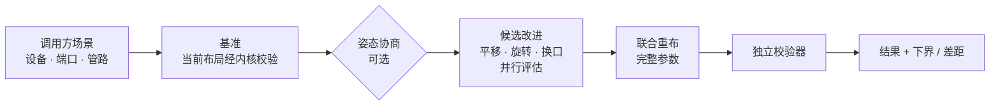

<div align="center">

# layout-kernel

**设备与管道自动排布的计算内核**

设备摆放 · 三维正交布管 · 多管协商消冲突 · 设备平移 / 旋转 / 三通换口优化 · 下界与差距 · 独立校验器

[English](README.md) · **简体中文**

[](LICENSE)
[](pyproject.toml)
[](tests)
[](src/layout_kernel/astar_fast.py)

</div>

---

## 为什么用它

| | |
|---|---|
| 🎛️ **约束全部由调用方配置** | 13 条约束，每条都有开关和参数，必须显式写出。内核不写死约束，也不设默认值，缺了直接报错。 |
| ✅ **结果以校验器为准** | 返回的违规和指标都来自只看几何的独立校验器，不依赖求解器内部数据。 |
| 📉 **启发式求解，附下界** | 给出可行且较优的方案，并报告在最终设备位置下离下界的最大差距。这不是最优性证明，文档里说清楚了。 |
| 🔌 **可接入已有项目** | 场景接口直接使用对方的设备实例、端口、姿态和现有管路，返回管路折点、设备平移和朝向。 |

## 工作流程



- **单管布线**：网格上的 A\*（numba 编译，与纯 Python 参考实现逐例一致），状态包含方向、直管长度、高度变化次数。支持多起点、多终点，用于在候选姿态之间选择。
- **多管协商**：PathFinder 式的拥堵加价，多个进程并行，共享拥堵地图。最后做清理：其余管作为硬障碍，冲突管单独重布。
- **姿态协商**：同一节点上的几根管选了不同姿态时，像拥堵一样逐轮加价，直到一致。
- **设备移动**：串联拉直、单个对齐、换朝向。候选并行评估，互不相干的一批一次接受；受时间上限约束。

## 安装

需要 Python 3.11+。建议装在独立虚拟环境里（`ortools` 会升级 `protobuf`，可能与其他项目冲突）：

```bash
python -m venv .venv
.venv/Scripts/python -m pip install "layout-kernel @ git+https://github.com/66-zhimeng/layout-kernel"
# 开发：git clone 后 pip install -e ".[test,plot]"
```

依赖：numpy、scipy、numba、ortools（CP-SAT）、networkx。

## 三种用法

<details open>
<summary><b>1. 任务书：摆放 + 布管，或只布管</b></summary>

```python
from layout_kernel import solve

if __name__ == "__main__":                       # 摆放用多进程，必须放在这里
    result = solve("examples/case_small_plant.json")
    print(result["ok"], result["metrics"])
```

```bash
layout-kernel examples/case_small_plant.json -o 方案.json
```

`task.mode` 选 `place_and_route`（求设备位置和管道）或 `route_only`（设备位置已给定）。字段见 [docs/contract.md](docs/contract.md)。
</details>

<details>
<summary><b>2. 三维场景：接入已有项目</b></summary>

```bash
layout-kernel-scene < 请求.json > 结果.json
```

请求里是节点（包围盒、各候选朝向下的端口）、管路（端点、现有折点、外径、直颈），以及设置（约束、权重、时间上限等）。结果里是新的管路折点、设备平移 `offsets`、换了朝向的节点 `orientations`、下界与差距。完整说明见 [docs/contract.md 第 7 节](docs/contract.md)。
</details>

<details>
<summary><b>3. 直接调用布管器</b></summary>

```python
from layout_kernel import routing as rt

sc = rt.Scene(DEVICES, NETS, ROUTING, WEIGHTS, SCALE)   # ROUTING 含 constraints
routes, history, G = rt.negotiate(sc)
viol, metrics = rt.check_routes(sc, routes)
```

可运行示例见 [examples/minimal_routing.py](examples/minimal_routing.py)，每个参数都有注释。
</details>

## 约束开关

| 约束 | 含义 |
|---|---|
| `pipe_pipe_clearance` | 不同管外壁之间的净距 |
| `pipe_equipment_clearance` | 管与设备包围盒的净距 |
| `self_clearance` | 同一根管沿管长相隔较远的两段之间的净距 |
| `height_change_limit` | 每条支路高度变化次数上限 |
| `ceiling` | 管顶最高标高 |
| `service_zones` | 检修区下方不得走管 |
| `straight_lengths` | 管件之间的最短直管 |
| `low_pipes` | 低位管的中心线高度上限 |
| `junction_merge_exemption` | 汇合于同一三通的两根管在口附近不算冲突（只对这两根管成立） |
| `internal_spools` | 三通内部短管、斜支口斜段是其他管的障碍 |
| `equipment_spacing` | 移动设备时的设备间距 |
| `equipment_keepout` | 设备禁区 |
| `pipe_keepout` | 管道禁区 |

每一条都要显式写 `"enabled": true/false`；参数和关闭时的含义见契约文档。

## 真实项目上的表现

接入 Three.js 系统管网页（230 根管、183 个节点），内核结果还要再通过网页自己的实体校验才会被应用：

| 场景 | 结果 | 用时 |
|---|---|---|
| 全局优化 | 弯头 454 → 约 340–370，管长 2173 → 约 2090 m | 60–300 s（可设） |
| 离下界的差距 | 1.4%–2.7% | 下界约 5 s |
| 局部（3 个传感器） | 弯头 464 → 458，差距 0% | 约 8 s |

> 差距是在最终设备位置和朝向下计算的，各管单独求最短路后相加。它不是设备也能移动时的全局下界。并行协商每次结果略有不同。

## 模块

| 模块 | 作用 |
|---|---|
| `constraints.py` | 约束注册表与配置校验 |
| `routing.py` | 网格、A\*、三通、协商布线、姿态协商、清理、独立校验器 |
| `astar_fast.py` | 单管 A\* 的 numba 实现（多起点 / 多终点） |
| `scene.py` / `scene_cli.py` | 三维场景接口：每管管径与直颈、斜支口、固定管路、设备平移 / 旋转 / 换口优化、下界 |
| `placement_sp.py` / `placement_cpsat.py` | 块级摆放（序列对 + LP + 并行退火 / CP-SAT）与摆放校验 |
| `blocking.py` | 设备 → 块：模块识别、模块内部排法、聚簇 |
| `api.py` / `contract.py` / `build.py` | 任务书接口、契约校验、模块间的粘合 |
| `coarse_route.py` | 粗网格快速布管（秒级判断能否布下） |

## 测试

```bash
.venv/Scripts/python -m pytest -q        # 62 个
```

## 已知限制

- 管道只走网格线（间距可配置）；管径不同时，占用计算按最大管径保守处理，管截面按正方形算。
- 摆放只在平面内；场景优化中设备只做平移，朝向在调用方给出的候选朝向里选。
- 启发式求解；下界只针对最终设备位置，多端点管网不给下界。

## 相关

研究过程（数学模型推导、各轮实验与失败记录）在 [math-problem-discussions](https://github.com/66-zhimeng/math-problem-discussions)。

## 许可

[Apache-2.0](LICENSE)
