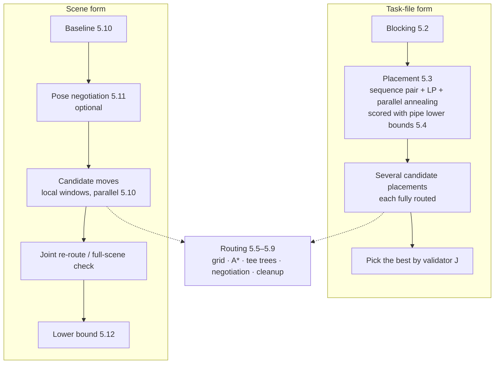

# Mathematical model and solution method

**English** · [简体中文](model.md)

This document defines the problem layout-kernel solves (inputs, variables, constraints, objective), explains the method used at each step, and states which results are proven and which are heuristic. Code comments cite its section numbers.

**Contents**

1. [Problem](#1-problem)
2. [Inputs and decision variables](#2-inputs-and-decision-variables)
3. [Constraints](#3-constraints)
4. [Objective](#4-objective)
5. [Solution method](#5-solution-method)
6. [Independent validator](#6-independent-validator)
7. [What is proven, what is heuristic](#7-what-is-proven-what-is-heuristic)
8. [Simplifications and limitations](#8-simplifications-and-limitations)

---

## 1. Problem

Given equipment with volume and ports, and the pipe connections between them, the kernel:

- decides where each piece of equipment goes and how it is oriented (within the allowed range);
- routes an orthogonal path for each connection (only along ±X, ±Y, ±Z, only 90° elbows, with tees for connections of three or more terminals);

so that all enabled constraints hold and a weighted sum of footprint, pipe length, bend count and elevation changes is minimal.

**Out of scope**: flow, pressure drop, energy, heat loss, stress, supports, and wall penetrations.

The kernel offers two forms of the problem:

| Form | Equipment | Pipes |
|---|---|---|
| Task file (`solve`) | The kernel chooses plan position and 90° rotation, or all positions are given (routing only) | All routed by the kernel |
| Scene (`optimize_scene`) | Starts from the caller's current poses; translates within a range, or picks among caller-supplied candidate poses | The caller may fix some pipes; the kernel re-routes the rest |

## 2. Inputs and decision variables

### 2.1 Inputs

- **Equipment** i: an axis-aligned bounding box B_i and a set of ports P_i. Each port p has a position q_p and an exit direction u_p ∈ U₆ = {±X, ±Y, ±Z}. The scene interface also allows oblique ports (§3.2).
- **Maintenance zones**: plan rectangles attached to equipment, transformed with it.
- **Connection** e: a terminal set T_e ⊆ ∪P_i and an outer diameter D_e. With |T_e| = 2 it is one pipe; with |T_e| ≥ 3 it is a network with tees.
- **Fixed routes**: existing pipes (polyline plus diameter) that are not routed and act only as obstacles.
- **Internal spools**: short pipes inside a node, such as tee internals. They belong to the node and block other pipes.
- **Keep-outs**: equipment and pipe keep-out boxes.
- **Parameters**: clearances, straight lengths, bend radii, height limits and so on. All come from the caller; there are no defaults (§3).

### 2.2 Decision variables

| Variable | Task-file form | Scene form |
|---|---|---|
| Position t_i | A plan grid point (x_i, y_i) ∈ grid·ℤ², with fixed height | t_i = t_i⁰ + Δ_i with \|Δ_i\| ≤ r (`radius`) on each axis |
| Orientation | R_i ∈ {0°, 90°, 180°, 270°} about the vertical axis | One of the caller-supplied poses {O_i⁰, O_i¹, …}: any rotation, tee re-orientation, or swap of same-direction ports |
| Route geometry Γ_e | An orthogonal polyline between ports (an orthogonal Steiner tree for multi-terminal nets) | same |

**World ports**: q_p = R_i q̂_p + t_i and u_p = R_i û_p. In the scene form, the caller precomputes the ports of each candidate pose.

## 3. Constraints

Each constraint has a switch, and when it is on, all its parameters must be given (registry: `constraints.py`). Below, δ denotes a clearance and D a pipe's outer diameter.

### 3.1 Equipment

1. **No overlap, plus spacing**: dist(B_i, B_j) ≥ δ_ee (`equipment_spacing`; `delta_ee_mm` in the task-file form).
2. **Maintenance zones** must not overlap other equipment (zones may overlap each other). Whether they must lie inside the footprint rectangle is set by `service_zones_inside_footprint`, which has no default.
3. **Equipment keep-out**: B_i must not intersect a keep-out (`equipment_keepout`).
4. **Locks**: equipment with a locked position or orientation does not move.

### 3.2 Route geometry

1. **Orthogonal**: each straight segment has a direction τ ∈ U₆, and consecutive segments are perpendicular (90° elbows). No 180° reversals.
2. **Ports**: a route leaves port p along u_p and enters port q along −u_q.
3. **Minimum straight runs** (`straight_lengths`): every pair of fittings is separated by straight pipe:

   ```
   elbow–elbow: len ≥ 2ρ + ℓ_min
   port–elbow:  len ≥ ρ + ℓ_min, or a caller-given per-end requirement s_p
   ```

   where ρ = c_ρ·D is the bend radius. Tee branches use ρ in the same way.
4. **Ports inside the equipment box**: the stretch from the port to the box face does not count toward the straight run needed before the first bend, so the first bend (including its trim) lies outside the box.
5. **Oblique ports** (scene interface): when a port's normal is oblique, an oblique stub leaves along the normal (the stub from the current route if it has one, otherwise one of length `oblique_stub_mm`). A 45° fitting at the stub's end continues into the orthogonal route. The stub belongs to its node and blocks other pipes.
6. **Matching the caller's rules** (scene interface, `pipe_rules`): when the caller trims elbows by trim = min(R, k·adjacent straight) and requires the effective radius to exceed D/2 plus a margin, the kernel converts this into its own straight-run requirements:

   ```
   between bends  S_ee = (D_r/2 + m_r) / k
   port to bend   S_pe = lead + R + m_p          (if k·(lead + R + m_p) ≥ R)
                        (lead + m_p) / (1 − k)    (otherwise)
   ρ = S_ee / 2, port requirement s_p = S_pe
   ```

   For a port inside its box, the in-box length d_in is folded into the lead, lead' = d_in + max(lead, D/2 + δ_ep − m_p), so the whole elbow arc lies outside the box and keeps its clearance.

### 3.3 Clearances and obstacles

Pipe sections are treated as squares of side D (more conservative than round pipe).

1. **Pipe–pipe** (`pipe_pipe_clearance`): outer walls of different pipes are ≥ δ_pp apart.
2. **Pipe–equipment** (`pipe_equipment_clearance`): a pipe's outer wall is ≥ δ_ep from equipment boxes; when off, the clearance is 0 (touching is allowed, crossing is not). A port's own equipment is exempt along the port lead.
3. **Self clearance** (`self_clearance`): two segments of the same pipe that are more than `skip_along_mm` apart along the pipe must also be ≥ δ_pp apart (no wrap-around or self-intersection).
4. **Merge exemption at tees** (`junction_merge_exemption`): when several pipes meet at a node without a solid box (a tee), within r_pp = D_max + δ_pp of its ports **only those pipes are exempt from each other**. Any other pipe passing by is checked normally.
5. **Internal spools** (`internal_spools`): a node's internal spools and oblique stubs block pipes not attached to that node. Pipes attached to the node are exempt only on their first and last segment.
6. **Maintenance zones** (`service_zones`): no pipe below the given height inside a zone.
7. **Pipe keep-outs** (`pipe_keepout`). **Ceiling** (`ceiling`): top of pipe ≤ z_max. **Low pipes** (`low_pipes`): a pipe marked low keeps its centerline below the given height.
8. **Fixed routes** are hard obstacles and count in clearance checks. Two fixed routes are not checked against each other, since neither is a result of this solve.

### 3.4 Elevation changes

Split a branch, in order, into horizontal and vertical segments, and drop the vertical parts between each port and the first (or last) horizontal segment. For consecutive horizontal segments:

```
N_layer(e) = #{consecutive horizontal pairs (a, b) : |z_a − z_b| > ε_z}
```

A run of consecutive vertical segments counts once. With `height_change_limit` on, N_layer(e) ≤ K.

## 4. Objective

```
J = w_A · A/A₀ + w_L · L/L₀ + w_B · N_bend/B₀ + w_C · N_layer/C₀
```

| Term | Definition |
|---|---|
| A | Area W·H of the XY axis-aligned bounding rectangle of all equipment and pipes, padded to aspect ratio κ: W ← max(W, H/κ), H ← max(H, W/κ) |
| L | Total centerline polyline length (right-angle corners at elbows, arcs not deducted) |
| N_bend | Number of 90° elbows; an elbow turned into a tee no longer counts |
| N_layer | Number of elevation changes (§3.4) |
| A₀, L₀, B₀, C₀ | Normalization scales from the caller (the task-file form can derive them from the input) |

**Per-pipe weights**: each pipe's L, N_bend and N_layer can be multiplied by its own factors w_L^e, w_B^e, w_C^e (for example, making bends on a main header more expensive).

Weights are exchange rates: with w_B/B₀ = 3 and w_L/L₀ = 1/1000 mm, one bend is worth 3 m of pipe.

## 5. Solution method

The overall approach is **decomposition**: place first, then route. The scene form instead repeats "move equipment locally, re-route locally". Every result is checked by the validator of §6.

### 5.1 Pipeline



### 5.2 Blocking

Equipment is first grouped into blocks, and placement works at the block level:

1. **Standard (rigid) modules**: fixed internal layout, moved or rotated as a whole. They come from module annotations in the input, or from automatically detected repeats: parallel arrays (same type, each port on the same net) and chain modules (grown in lockstep from same-type equipment along two-terminal connections). Detected modules are reported but not merged by default (`auto_module_policy`).
2. **Internal layouts**: taken from the annotation when present; otherwise CP-SAT computes a compact layout for each of several aspect-ratio bands, and these become candidates.
3. **Clustering**: blocks are clustered by connectivity. This is only a solving aid; it does not lock relative positions.

### 5.3 Placement

**Representation**: a sequence pair (Γ⁺, Γ⁻), plus each block's rotation and each copy group's internal layout.

- i is left of j ⇔ i precedes j in both sequences;
- i is below j ⇔ i follows j in Γ⁺ and precedes j in Γ⁻.

**Evaluating a candidate**:

1. **Longest path**: the sequence pair gives difference constraints, which yield the minimal bounding size W\*, H\* (padded to κ). A conflict with fixed blocks rejects the candidate immediately.
2. **Fast bound**: J ≥ area term(W\*, H\*) + constant length terms + known bend terms. Annealing draws its acceptance threshold first and skips the LP when the bound already exceeds it. This gives exactly the same result as solving the LP and then rejecting, only faster.
3. **Linear program (HiGHS)**: the variables are block coordinates, W, H and per-net auxiliaries. The objective is the area's tangent plane at (W\*, H\*) plus the pipe lower bounds (§5.4).
   - A two-terminal net that can connect straight (same height, facing) and is flagged "direct" gets an "aligned axes, gap ≥ ℓ_min" constraint.
   - Maintenance zones: for each block pair, in the direction given by the sequence pair, the gap is max(block clearance, either zone's protrusion). This is a sufficient condition.
   - **Pipe exit margins**: a block side with k ports reserves

     ```
     m = ℓ_min + ρ + (k − 1)·(D + δ_pp) + D/2 + δ_ep   (rounded up to the grid)
     ```

     This leaves room for pipes to run straight out of the ports to their first bend, then run side by side in k lanes along that side, with the outermost lane keeping δ_ep from the neighbor. The gap between adjacent blocks is at least the sum of both sides' margins, so ports are never blocked by a neighbor.
4. **Score**: the placement validator's J.

**Search**: simulated annealing on several processes; each cooling cycle reheats from the global best.

**Alternative route**: an exact CP-SAT model where each block picks exactly one (internal layout × 90° rotation) pose, with non-overlap, clearances, maintenance zones, fixed blocks, the bounding rectangle, the aspect ratio and pipe lower bounds. It suits small problems and also provides the placement validator.

**Multiple candidates**: different seeds give several placements. Each one is fully routed, and the one with the best **true** J wins, because placement only sees pipe lower bounds, not real lengths and bends.

### 5.4 Pipe lower bounds used in placement

For a two-terminal connection with ports p, q:

```
direct (same height, facing, aligned, gap ≥ ℓ_min): length = |p − q|₁, bends 0
otherwise:
  length ≥ max(|p − q|₁, 2ℓ_min + |s_p − s_q|₁), where s = port + ℓ_min·u is the stub point
  bends ≥ b, with exit direction d₀ = u_p and arrival direction d₁ = −u_q:
    different heights → b = 2
    d₀ = d₁ (same direction but misaligned or too close) → b = 2
    d₀ = −d₁ → b = 2
    d₀ ⊥ d₁ → b = 1
```

**Multi-terminal connections** (|T| = k ≥ 3): length ≥ k·ℓ_min + the sum over axes of the span of the stub points. This is a lower bound for a rectilinear Steiner tree.

These are **provable lower bounds**: no real route can be shorter or have fewer bends.

### 5.5 Routing grid

A non-uniform 3D track grid. The candidate coordinates on each axis combine:

- multiples of the base pitch `pitch_mm`;
- all port coordinates;
- equipment box boundaries inflated by δ_ep + D/2;
- maintenance-zone and keep-out boundaries inflated by D/2;
- optionally, port coordinates ± (D + δ_pp).

Pipe centerlines run only along the axis edges between grid intersections. Obstacles are handled like this:

- equipment, keep-outs and the "halo" of fixed routes are marked impassable;
- a **halo** is every edge whose distance to the pipe centerline is below D/2 + D_max/2 + δ_pp on every axis. The condition separates by axis, so the halo is computed in one vectorized pass.

### 5.6 Single-pipe A\*

**State**: (node, direction, whether the last fitting was a port, elevation changes so far, whether a horizontal segment exists yet, straight length since the last fitting).

- **Turning rule**: the straight length must be ≥ ρ_prev + ρ + ℓ_min, where ρ_prev is 0 if the last fitting was a port.
- **Edge cost**:

  ```
  c(edge) = c_L · length · (1 + h_e) · (1 + π · n_e)
  plus c_B per turn, and c_C for horizontal → vertical → horizontal with a height change
  c_L = w_L·w_L^e / L₀,  c_B = w_B·w_B^e / B₀,  c_C = w_C·w_C^e / C₀
  ```

  Here n_e is the number of other pipes occupying the edge, h_e its history cost, and π the current pressure (§5.8).
- **Heuristic** (admissible, never overestimating): c_L · Manhattan distance + c_B · the minimum number of bends still needed. Toward a port, that is 0 if already facing in the right direction, 1 if perpendicular, and 2 otherwise.
- **Dominance pruning**: under the same state key, a state with at least as much straight length and no higher cost prunes the other.
- **Self clearance** is checked on the whole polyline when a goal is reached; if it fails, the search continues.
- **Multiple starts and goals**: each start or goal carries an extra cost. g starts at the start's cost, and the goal's cost is added on arrival. The heuristic takes the minimum over goals and stays admissible. This powers pose negotiation (§5.11).

A\* is compiled with numba. Tests compare it case by case against a pure-Python reference, requiring the same number of expansions and the same polylines. With `astar_weight > 1` it becomes weighted A\*, and a single pipe's cost is then at most that factor times the optimum.

### 5.7 Multi-terminal nets (tee trees)

The two nearest terminals are connected first. The rest join the tree one by one, nearest first:

- a terminal can join perpendicularly in the interior of a straight segment, forming a right-angle tee;
- or it can join along the extension of one leg of an elbow, turning that elbow into a tee.

Straight runs on both sides of a tee must also meet the minimum lengths. The distance field to the tree is a separable Manhattan distance, computed in one vectorized pass and updated incrementally as the tree grows.

### 5.8 Multi-pipe negotiation (PathFinder style)

First, every pipe is routed once with congestion costs. Then, in each round:

1. all conflicted pipes are re-routed, where n_e counts the other pipes currently occupying each edge;
2. at the end of the round, history costs grow on conflicted edges: h_e ← h_e + `hist_fac`;
3. the pressure grows: π ← π · `pres_fac_mult`.

This stops when there are no conflicts, when the round limit is reached, or after `stall_iters` rounds without improvement.

**Parallelism (optimistic concurrency)**: `route_workers` processes search at the same time over one occupancy map in shared memory, which only the main process writes. When a pipe finishes, if its path falls into the halo of a pipe committed after its search began, the result is discarded and the pipe is re-searched on the latest map (at most twice per round).

**Freezing**: a pipe whose search repeatedly hits the expansion limit, so that it keeps its old path, is no longer re-searched during negotiation and is left to cleanup.

### 5.9 Cleanup

For each clash X–Y reported by the validator, the kernel tries in order: re-route X only → Y only → X then Y → Y then X. While re-routing, every other pipe is a **hard obstacle**, with no congestion cost. The first plan that removes this clash without increasing the total number of clashes is accepted.

The records distinguish "search space exhausted" (truly no path on this grid given the other pipes) from "expansion limit hit" (inconclusive). When few pipes remain in conflict, cleanup is also tried in the middle of negotiation.

### 5.10 Scene optimization: moving equipment

1. **Baseline**: the caller's current routes are checked with the kernel's validator. If they pass, they become the baseline, so the result is never worse than what the caller has now. If only a few pipes fail, just those are re-routed; if many fail, everything is re-routed.
2. **Candidates**:
   - **Line-straightening**: a chain of in-line devices (sensors, valves) connected along one axis is shifted as a whole onto one line. Candidate lines come from the lateral coordinates of the chain's outer ends and of its own ports.
   - **Single alignment**: a movable node is aligned to the port line at the far end of a connected pipe (both lateral coordinates, or just one).
   - **Pose changes**: each candidate pose is estimated by "Manhattan distance between ports + a bend lower bound", and only the best `rotation_candidates` are really evaluated.
3. **Evaluation**: a candidate re-routes only the pipes attached to the moved nodes; all other pipes stay fixed on their current routes as obstacles. This happens inside a **local window**: the bounding box of the affected routes and moved nodes, expanded by `window_mm`. Fixed routes and nodes more than 1 m from the window are dropped. New routes can only appear inside the window, and everything dropped is farther away than any clearance, so feasibility is unaffected. Evaluation uses the lighter `candidate_routing` parameters, on several processes.
4. **Acceptance**: improving candidates are sorted by gain. A batch of mutually independent ones (no shared moved nodes or affected pipes) is combined and re-checked; if it still improves, the whole batch is accepted, otherwise only the best candidate is.
5. **Finish**: once nothing improves, the final poses are jointly re-routed with the full parameters and the better result is kept. When time is short, the step-by-step result gets one full-scene validation instead.

### 5.11 Pose negotiation

This step folds pose selection into routing negotiation, instead of evaluating pose candidates one by one:

- Each movable node gets its current pose plus up to `max_poses` candidate poses (re-orientations and translation candidates, ranked by estimate). Poses that alone would violate spacing, a keep-out or the ceiling are dropped first.
- Each candidate pose becomes a **virtual node** with only ports and internal spools. Its box is not an obstacle, and its ports may pass through the real node's current box.
- Each pipe runs a **multi-start, multi-goal A\*** (§5.6) over all candidate ports of its two end nodes, choosing both poses at once.
- **Disagreement pricing**: when pipes at the same node pick different poses, picking a minority pose costs

  ```
  extra(pipe e, pose k) = c_B · (pres_bends · π · #{pipes at the node that picked another pose} + H(node, k))
  ```

  At the end of each round, for every node where the picks disagree, each pose k accumulates history:

  ```
  H(node, k) += hist_bends · (pipes that picked another pose) / (pipes at the node)
  ```

  and those pipes are re-routed in the next round, until all picks agree (if they still disagree, the majority wins).
- The chosen poses are then re-routed under the real rules (real boxes, full parameters) and validated, and are accepted only if the result is better. If a few nodes cannot be routed under the real rules, they fall back to their original poses and the kernel tries again.

### 5.12 Lower bound and gap

Fix the equipment at its final positions and poses. For each two-terminal pipe **on its own**, find the exact shortest route: unweighted A\*, ignoring the other pipes being routed, with fixed routes and keep-outs still as obstacles, and with the pipe's clearance to itself relaxed (relaxing a constraint can only lower the optimum). The sum is LB:

```
LB ≤ the cost of any feasible solution with these equipment poses
gap = (cost − LB) / cost
```

gap bounds how far the result can be from the optimum. It is **not** a global bound for equipment that can still move, and multi-terminal nets get no bound.

## 6. Independent validator

`routing.check_routes` looks only at polyline geometry and reads nothing from the solver. It checks:

- port directions, orthogonality, perpendicular consecutive segments;
- minimum straight runs (including in-box ports, per-end requirements, fitting ports);
- the elevation-change limit;
- self clearance;
- pipe–equipment clearance (port leads exempt), maintenance zones, keep-outs, height range;
- internal spools;
- pipe–pipe clearance (the merge exemption applies only to two pipes sharing the node).

It also computes all the metrics of §4. **Every `ok`, violation and J in a result comes from it.** Placement has its own validator, `placement_cpsat.validate`.

## 7. What is proven, what is heuristic

| Result | Status |
|---|---|
| Length and bend bounds of §5.4 | Proven lower bounds |
| Single-pipe A\* (`astar_weight` = 1, no congestion, self clearance relaxed) | Exact optimum for one pipe on the grid (with the self-clearance check on, dominance pruning may cut feasible paths, which is why the lower bound relaxes it) |
| LB and gap of §5.12 | A valid lower bound at the final equipment poses; not for equipment that can still move |
| Placement (sequence pair + LP + annealing) | Heuristic |
| Negotiation, cleanup, candidate moves, pose negotiation | Heuristic; neither feasibility nor optimality is guaranteed |
| Grid discretization | Routes follow grid lines only and may miss better off-grid paths |

## 8. Simplifications and limitations

- Pipe sections are squares. With mixed diameters, the grid and halos use the largest diameter, conservatively.
- Length is measured on the polyline, with right-angle corners at elbows and no arc deduction. Tees are points.
- Branches of the same net are not checked against each other. For multi-terminal nets, elevation changes are counted per branch.
- The task-file form places in plan only, rotating about the vertical axis. The scene form only translates, and picks orientations from the caller's candidates.
- Relative constraints between equipment ("must be adjacent", "against a wall") are not supported.
