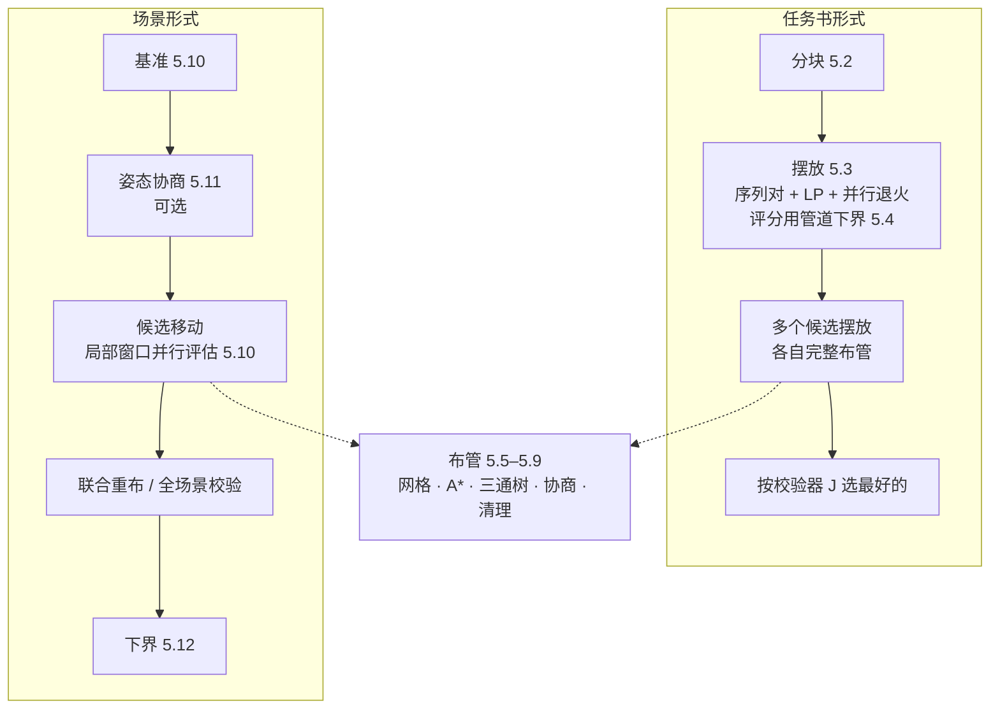

# 数学模型与求解方法

[English](model.en.md) · **简体中文**

本文定义 layout-kernel 求解的问题（输入、变量、约束、目标），并说明每一步用什么方法求解、哪些结论已经证明、哪些是启发式。文中编号在代码注释里会引用。

**目录**

1. [问题](#1-问题)
2. [输入与决策变量](#2-输入与决策变量)
3. [约束](#3-约束)
4. [目标函数](#4-目标函数)
5. [求解方法](#5-求解方法)
6. [独立校验器](#6-独立校验器)
7. [证明与启发式的边界](#7-证明与启发式的边界)
8. [简化与限制](#8-简化与限制)

---

## 1. 问题

给定一组有体积、有端口的设备，以及它们之间的管道连接关系：

- 决定每台设备放在哪里、朝向如何（在允许的范围内）；
- 为每条连接布一条正交管路（只沿 ±X、±Y、±Z 走，只用 90° 弯头；三个及以上端点的连接用三通）；

在满足全部启用约束的前提下，使占地、管长、弯头数和高度变化次数的加权和最小。

**不在范围内**：流量、压降、能耗、热损失、应力、支吊架和穿墙成本。

内核提供两种问题形式：

| 形式 | 设备 | 管道 |
|---|---|---|
| 任务书（`solve`） | 平面位置和 90° 旋转都由内核决定，或者全部给定（只布管） | 全部由内核布 |
| 场景（`optimize_scene`） | 从调用方的当前姿态出发，在允许范围内平移，或在调用方给出的候选姿态里选择 | 调用方可以固定一部分，其余由内核重布 |

## 2. 输入与决策变量

### 2.1 输入

- **设备** i：包围盒 B_i（轴对齐长方体），端口集合 P_i。每个端口 p 有位置 q_p 和出管方向 u_p ∈ U₆ = {±X, ±Y, ±Z}；场景接口还允许斜向端口，见 3.2。
- **检修区**：挂在设备上的平面矩形，随设备一起变换。
- **连接** e：端点集合 T_e ⊆ ∪P_i，管外径 D_e。|T_e| = 2 时是一根管；|T_e| ≥ 3 时是一个带三通的管网。
- **固定管路**：不参与布管、只作为障碍的已有管道（折线加外径）。
- **节点内部短管**（spool）：例如三通内部的接管，属于某个节点，是其他管的障碍。
- **禁区**：设备禁区与管道禁区（三维盒）。
- **参数**：净距、直管长度、弯曲半径、高度上限等，全部由调用方给出，不设默认值（见第 3 节）。

### 2.2 决策变量

| 变量 | 任务书形式 | 场景形式 |
|---|---|---|
| 设备位置 t_i | 平面网格点 (x_i, y_i) ∈ grid·ℤ²，高度固定 | t_i = t_i⁰ + Δ_i，每轴 \|Δ_i\| ≤ r（`radius`） |
| 设备朝向 | R_i ∈ {0°, 90°, 180°, 270°}，绕竖直轴 | 在调用方给出的候选姿态 {O_i⁰, O_i¹, …} 中选一个（可以是任意旋转、三通换向、同向口交换） |
| 管路几何 Γ_e | 端口之间的正交折线（多端点时是正交 Steiner 树） | 同左 |

**端口的世界坐标** q_p = R_i q̂_p + t_i，方向 u_p = R_i û_p。场景形式里，候选姿态的端口已经由调用方算好。

## 3. 约束

每条约束都有开关，打开时参数必须给全（约束注册表 `constraints.py`）。下面 δ 表示净距，D 表示管外径。

### 3.1 设备

1. **不重叠加间距**：dist(B_i, B_j) ≥ δ_ee（`equipment_spacing`；任务书形式里是 `delta_ee_mm`）。
2. **检修区**：检修区不能与其他设备重叠（检修区之间允许重叠）；是否必须位于占地矩形内由 `service_zones_inside_footprint` 决定，没有默认值。
3. **设备禁区**：B_i 与禁区不相交（`equipment_keepout`）。
4. **锁定**：固定位置或朝向的设备不动。

### 3.2 管路几何

1. **正交**：每个直管段的方向 τ ∈ U₆，相邻两段互相垂直（90° 弯头）；不允许 180° 掉头。
2. **端口**：管路从端口 p 沿 u_p 离开，沿 −u_q 进入端口 q。
3. **最短直管**（`straight_lengths`）：任意两个管件之间必须有直管：

   ```
   弯头—弯头：len ≥ 2ρ + ℓ_min
   端口—弯头：len ≥ ρ + ℓ_min，或调用方给出的每端要求 s_p
   ```

   其中 ρ = c_ρ·D 是弯曲半径。三通两侧同样按 ρ 计算。
4. **端口在设备盒内**：端口到盒面这一段不计入“转弯前所需直管”，保证第一个弯（包括弯头让位）在盒外。
5. **斜支口**（场景接口）：端口法向是斜的时，先沿法向伸出一段斜管（沿用现有路径里的斜段，或伸出 `oblique_stub_mm`），斜段终点接一个 45° 管件，之后再接正交管路。斜段属于所在节点，是其他管的障碍。
6. **与调用方规则对齐**（场景接口，`pipe_rules`）：调用方的弯头让位是 trim = min(R, k·相邻直管)，而且要求有效半径大于 D/2 加余量时，内核把它换算成自己的直管要求：

   ```
   两弯之间 S_ee = (D_r/2 + m_r) / k
   端口到弯 S_pe = lead + R + m_p            （若 k·(lead + R + m_p) ≥ R）
                 (lead + m_p) / (1 − k)        （否则）
   ρ = S_ee / 2，端口要求 s_p = S_pe
   ```

   端口在设备盒内时，把盒内长度 d_in 并入 lead，即 lead' = d_in + max(lead, D/2 + δ_ep − m_p)，保证弯头圆弧整段在盒外，并与设备留有净距。

### 3.3 净距与障碍

管截面按边长为 D 的正方形处理（比圆管保守）。

1. **管—管**（`pipe_pipe_clearance`）：不同管外壁之间的距离 ≥ δ_pp。
2. **管—设备**（`pipe_equipment_clearance`）：管外壁到设备盒的距离 ≥ δ_ep；关闭时按 0 处理（可以贴着，不能穿过）。端口所属设备在端口接入段豁免。
3. **同管自身**（`self_clearance`）：同一根管上，沿管长相隔超过 `skip_along_mm` 的两段之间也要 ≥ δ_pp（防止回绕和自交）。
4. **三通汇合豁免**（`junction_merge_exemption`）：几根管接在同一个没有实体盒的节点（三通）上时，在节点口附近长度 r_pp = D_max + δ_pp 的范围内，**只有这几根管彼此之间**不计冲突；其他管路过这里照常检查。
5. **内部短管**（`internal_spools`）：节点内部短管和斜支口的斜段，对不接在这个节点上的管是障碍；接在该节点上的管只豁免首段与末段。
6. **检修区**（`service_zones`）：检修区在给定高度以下不得走管。
7. **管道禁区**（`pipe_keepout`）、**顶棚**（`ceiling`）：管顶不超过 z_max；**低位管**（`low_pipes`）：标为 low 的管，中心线不超过给定高度。
8. **固定管路**是硬障碍，也参与净距校验；两根固定管之间不检查（它们不是本次求解的结果）。

### 3.4 高度变化

把一条支路按顺序分成水平段和竖直段。去掉两端从端口到第一个（或最后一个）水平段之间的竖直部分，对相邻两个水平段：

```
N_layer(e) = #{相邻水平段对 (a, b) : |z_a − z_b| > ε_z}
```

中间连续的竖直段合计一次。`height_change_limit` 打开时要求 N_layer(e) ≤ K。

## 4. 目标函数

```
J = w_A · A/A₀ + w_L · L/L₀ + w_B · N_bend/B₀ + w_C · N_layer/C₀
```

| 项 | 定义 |
|---|---|
| A | 所有设备与管道的 XY 轴对齐外接矩形面积 W·H；长宽比不足 κ 时补足：W ← max(W, H/κ)，H ← max(H, W/κ) |
| L | 各管中心线折线长度之和（弯头处按直角角点，不扣弧长） |
| N_bend | 90° 弯头数；弯头处接三通的不算弯头 |
| N_layer | 高度变化次数（3.4） |
| A₀, L₀, B₀, C₀ | 归一化尺度，由调用方给出（任务书形式可由输入计算） |

**单管权重**：每根管的 L、N_bend、N_layer 可以乘以自己的倍数 w_L^e、w_B^e、w_C^e（例如主管的弯头更贵）。

权重的含义是兑换率。例如 w_B/B₀ = 3、w_L/L₀ = 1/1000 mm 时，1 个弯头相当于 3 m 管长。

## 5. 求解方法

总体思路是把问题**分解**：先摆放，再布管；场景形式则反复做“局部移动设备 → 局部重布”。每一步的结果都要交给第 6 节的校验器检查。

### 5.1 流程



### 5.2 分块

设备先组成“块”，摆放在块这一级进行：

1. **标准模块（刚性）**：内部相对位置固定，整体平移或旋转。来源有两种：输入里标注的模块；或者自动识别出的重复结构，包括并联阵列（同类型设备、各端口接在同一个管网上）和链式模块（从同类型设备出发，沿两端点连接同步生长）。自动识别的结果默认只报告、不合并（`auto_module_policy`）。
2. **内部排法**：标注了就用标注的；否则用 CP-SAT 在几个长宽比区间内各求一个紧凑排法，作为候选。
3. **聚簇**：按连接关系把块聚成簇。这只是求解手段，不锁定块的相对位置。

### 5.3 摆放

**解的表示**：序列对 (Γ⁺, Γ⁻)，加上每块的旋转、每个复制组的内部排法。

- i 在 j 左边 ⇔ i 在两个序列中都排在 j 前面；
- i 在 j 下面 ⇔ i 在 Γ⁺ 中排在 j 后面、在 Γ⁻ 中排在 j 前面。

**评估一个候选**：

1. **最长路**：由序列对得到差分约束，求出最小外接尺寸 W\*、H\*（按 κ 补足）。如果与固定块的位置冲突，直接判为不可行。
2. **快速下界**：J ≥ 面积项(W\*, H\*) + 管长常数项 + 已确定的弯头项。退火时先抽出接受阈值；下界已经超过阈值就不再解 LP。这与解完 LP 再拒绝的结果完全相同，只是更快。
3. **线性规划（HiGHS）**：变量是块坐标、W、H 和管网辅助变量。目标是面积在 (W\*, H\*) 处的切平面，加上管长下界（5.4）。
   - 两端点管网如果能直连（同高、正对）且直连标记为真，就加“轴线对齐、间距 ≥ ℓ_min”的约束；
   - 检修区：对每一对块，按序列对给出的方向，间距取 max(块间净距, 双方检修区伸出量)。这是一个充分条件。
   - **出管留空**：块的某一侧有 k 个端口时，这一侧预留

     ```
     m = ℓ_min + ρ + (k − 1)·(D + δ_pp) + D/2 + δ_ep   （向上取整到网格）
     ```

     含义是：管道离开端口直行到第一个弯，再沿这一侧并排走 k 条管道，最外一条与相邻设备保持 δ_ep。相邻两块之间的缝隙不小于两侧留空之和，避免端口被邻块堵住。
4. **评分**：以摆放校验器的 J 为准。

**搜索**：模拟退火，多进程并行，每个冷却周期结束时从全局最好解重新加热。

**另一条路线**：CP-SAT 精确模型，每块从“内部排法 × 90° 旋转”中恰好选一个，加上不重叠、净距、检修区、固定、外接矩形、长宽比、管道下界等约束。它适合小规模问题，并提供摆放校验器。

**多候选**：用不同种子得到若干候选摆放，每个都完整布管，按校验器给出的**真实** J 选最好的。原因是摆放阶段只看得到管道下界，看不到真实管长和弯头。

### 5.4 摆放阶段的管道下界

两端点连接，设端口 p、q：

```
能直连（同高、端口正对、轴线对齐、间距 ≥ ℓ_min）：长度 = |p − q|₁，弯头 0
否则：
  长度 ≥ max(|p − q|₁, 2ℓ_min + |s_p − s_q|₁)，其中 s = 端口位置 + ℓ_min·u 是伸出点
  弯头 ≥ b，d₀ = u_p 是出发方向，d₁ = −u_q 是到达方向：
    两端高度不同 → b = 2
    d₀ = d₁（同向但没对齐或太近） → b = 2
    d₀ = −d₁ → b = 2
    d₀ ⊥ d₁ → b = 1
```

**多端点连接**（|T| = k ≥ 3）：长度 ≥ k·ℓ_min + 各轴上伸出点坐标跨度之和。这是直角 Steiner 树的一个下界。

这些都是**可证明的下界**：真实管路不可能更短，也不可能更少弯头。

### 5.5 布管网格

非均匀的三维轨道网格。每个轴的候选坐标由以下几部分合成：

- 基础间距 `pitch_mm` 的整数倍；
- 所有端口坐标；
- 设备盒按 δ_ep + D/2 膨胀后的边界；
- 检修区、禁区按 D/2 膨胀后的边界；
- 可选：端口坐标 ± (D + δ_pp)。

管道中心线只走这些线的交点之间的轴向边。障碍是这样处理的：

- 设备、禁区、固定管路的“占用晕”标记为不可走；
- **占用晕**是指与管道中心线在每个轴上的距离都小于 D/2 + D_max/2 + δ_pp 的全部边，按轴可分离，用向量运算一次算出。

### 5.6 单管 A\*

**状态**：(节点, 方向, 上一个管件是不是端口, 已发生的高度变化次数, 是否已有水平段, 自上一个管件起走过的直管长度)。

- **转弯条件**：直管长度 ≥ ρ_prev + ρ + ℓ_min，其中 ρ_prev 在上一个管件是端口时为 0。
- **边代价**：

  ```
  c(边) = c_L · 长度 · (1 + h_e) · (1 + π · n_e)
  转弯另加 c_B；水平 → 竖直 → 水平并且高度改变，另加 c_C
  c_L = w_L·w_L^e / L₀，c_B = w_B·w_B^e / B₀，c_C = w_C·w_C^e / C₀
  ```

  其中 n_e 是其他管在这条边上的占用数，h_e 是历史拥堵代价，π 是当前压力（5.8）。
- **启发式**（可采纳，即不高估）：c_L · 曼哈顿距离 + c_B · 至少还需要的弯头数。到端口时，已经正对且方向一致为 0 个，垂直为 1 个，其他情况为 2 个。
- **支配剪枝**：同一个状态键下，如果一个状态的直管长度不短、代价不高，另一个就可以剪掉。
- **同管自身净距**：到达目标时检查整条折线，不满足就继续搜索。
- **多起点、多终点**：每个起点或终点带一个附加代价，g 从起点的附加代价开始，到达终点时加上终点的附加代价；启发式取所有终点的最小值，仍然可采纳。这用于 5.11 的姿态协商。

A\* 用 numba 编译。纯 Python 参考实现与编译版在测试中逐例比较，要求扩展数相同、折线相同。`astar_weight > 1` 时是加权 A\*，单管代价最多是最优值的这么多倍。

### 5.7 多端点管网（三通树）

先连最近的两个端点。其余端点按到已布树的距离，从近到远依次接到树上：

- 可以在直管段内部垂直接入，形成直角三通；
- 也可以沿弯头一条腿的延长线接入，把这个弯头改成三通。

三通两侧的直管同样要满足最短长度。到树的距离场是可分离的曼哈顿距离，用向量运算一次算出，并在树增长时增量更新。

### 5.8 多管协商（PathFinder 式）

各管先按拥堵代价各自布一次。每一轮：

1. 重布所有有冲突的管，边代价里的 n_e 是其他管当前的占用数；
2. 轮末，冲突边的历史代价累积：h_e ← h_e + `hist_fac`；
3. 压力放大：π ← π · `pres_fac_mult`。

直到没有冲突、达到最多轮数，或者连续 `stall_iters` 轮没有改进。

**并行（乐观并发）**：`route_workers` 个进程同时搜索，共享同一张占用表（共享内存），只有主进程写。一根管搜完时，如果它的路径落进了“它开始搜索之后才提交”的管的占用晕里，就丢弃结果、按最新地图重搜（每轮最多重搜 2 次）。

**冻结**：一根管连续几次搜索都撞到扩展上限、只能保留旧路径时，协商里不再重搜它，交给清理。

### 5.9 清理

对校验器报出的每一处冲突 X–Y，依次尝试：只重布 X → 只重布 Y → 先 X 后 Y → 先 Y 后 X。重布时其他所有管都作为**硬障碍**，不加拥堵代价。第一个“这处冲突消失、总冲突数不增加”的方案被接受。

记录会区分“搜索空间耗尽”（在当前网格和其他管道下确实无路）和“超过扩展上限”（不能下结论）。协商中途冲突的管数已经很少时，会先试一次清理。

### 5.10 场景优化：移动设备

1. **基准**：用内核校验器检查调用方的现有路径。通过就直接作为基准，从而不会比现状更差；只有少数管不符合时只重布这几根，不符合的太多就整网重布。
2. **候选**：
   - **串联拉直**：沿同一轴相连的在线设备（传感器、阀门），整串平移到同一条直线上；候选直线取自串外端点和串内各端口的横向坐标。
   - **单个对齐**：可移动节点对齐到相连管道另一端的端口直线上（两个横向坐标都对齐，或只对齐其中一个）。
   - **整串靠拢**：沿 X / Z 取一个切面（取自各设备在该轴上坐标的相邻中点），把切面一侧的可动设备**整体**朝另一侧平移。行程取各跨切面管道在该轴上可压缩余量（两端口在该轴上的间距减去最小直管长度）的最小值，按 1、1/2 两档试；所有切面都估一遍收益（行程 × 会变短的管数），每轮只真正评估收益最大的几个——挤紧过的切面余量变小，下一轮自然轮到别处；两端同在一侧的管随之整体平移，长度不变。前两族的位移永远垂直于管道走向，只消弯头、不缩短直管段，这一族专门压缩整体占地。行程只是估计，靠拢后撞不撞设备、够不够绕由候选评估的重布与校验器判定。
   - **换姿态**：按“端口间曼哈顿距离 + 弯头下界”估计每个候选姿态，只真实评估最好的 `rotation_candidates` 个。
3. **评估**：每个候选只重布与被移动节点相连的管，其余管按当前路径固定为障碍。这一步只在**局部窗口**内进行：窗口是相关管路和被移动节点的包围盒，外扩 `window_mm`；离窗口超过 1 m 的固定管和节点直接去掉。新路径只会出现在窗口内，而被去掉的东西离窗口都超过所有净距，所以不影响可行性判断。评估用 `candidate_routing` 的轻量参数，多进程并行。
4. **接受**：有改进的候选按改进量从大到小排序，挑出互不相干（被移动节点和相关管都不重叠）的一批，合在一起复核仍然有改进，就一次接受；否则只接受最好的一个。
5. **收尾**：没有改进后，按最终姿态用完整参数联合重布一次，取更好的结果；时间不够时，把逐步结果在全场景里完整校验一次。

### 5.11 姿态协商

这一步把姿态选择放进布管协商里一起做，取代逐个评估姿态候选：

- 每个可动节点取当前姿态，加上至多 `max_poses` 个候选姿态（换朝向和平移候选，按估计排序）。单独看就违反设备间距、禁区或顶棚的姿态先去掉。
- 每个候选姿态做成一个**虚拟节点**：只有端口和内部短管，包围盒不当障碍，它的端口可以穿过真实节点当前的盒子。
- 每根管在两端节点的所有候选端口之间做一次**多起点、多终点 A\***（5.6），同时选定两端的姿态。
- **分歧加价**：同一节点上的几根管选了不同姿态时，选少数派姿态的附加代价是

  ```
  附加代价(管 e, 姿态 k) = c_B · (pres_bends · π · #{同节点上选了别的姿态的管} + H(节点, k))
  ```

  轮末，对选择不一致的节点，给每个姿态 k 累积历史价：

  ```
  H(节点, k) += hist_bends · (选了别的姿态的管数) / (该节点的管数)
  ```

  并把相关的管列入下一轮重布，直到选择一致（仍不一致时按多数取）。
- 选定的姿态再按正式规则（真实设备盒、完整参数）重布并校验，更好才采用；个别节点按正式规则布不通时，退回原姿态再试。

### 5.12 下界与差距

把设备固定在最终的位置和姿态，对每根两端点管**单独**求精确最短路：A\* 不加权、不考虑其他待布的管；固定管路和禁区仍然是障碍；放宽同一根管自身的净距（放宽约束只会让最优值更小）。各管加起来得到 LB，有：

```
LB ≤ 该设备姿态下任何可行方案的代价
gap = (cost − LB) / cost
```

gap 表示当前方案最多比最优差多少。它**不是**设备还能移动时的全局下界；多端点管网不给下界。

## 6. 独立校验器

`routing.check_routes` 只看折线几何，不读取求解器的任何内部数据。它检查以下各项：

- 端口接入方向、正交、相邻段垂直；
- 最短直管（含盒内端口、每端要求、管件式端口）；
- 高度变化上限；
- 同管自身净距；
- 管—设备净距（端口接入段豁免）、检修区、禁区、高度范围；
- 内部短管；
- 管—管净距（汇合豁免只对共享同一个节点的两根管成立）。

同时计算第 4 节的全部指标。**所有结果的 `ok`、违规和 J 都来自它。** 摆放另有校验器 `placement_cpsat.validate`。

## 7. 证明与启发式的边界

| 结论 | 性质 |
|---|---|
| 5.4 的管长和弯头下界 | 已证明是下界 |
| 单管 A\*（`astar_weight` = 1，不带拥堵代价，放宽同管自身净距） | 在网格上对单管是精确最优（带着自身净距检查时，支配剪枝可能剪掉可行走法，因此下界计算要放宽它） |
| 5.12 的 LB 和 gap | 在最终设备姿态下是有效下界；不针对设备还能移动的情况 |
| 摆放（序列对 + LP + 退火） | 启发式 |
| 多管协商、清理、候选移动、姿态协商 | 启发式；不保证找到可行解，也不保证最优 |
| 网格离散化 | 只在网格线上走管，可能错过网格外更好的路径 |

## 8. 简化与限制

- 管截面按正方形处理；管径不同时，网格与占用晕按最大管径保守计算。
- 管长按折线计算，弯头处按直角角点，不扣弧长。三通按点处理。
- 同一管网内部各支路之间不检查净距；多端点管网的高度变化按支路分别计数。
- 任务书形式只做平面摆放，旋转只绕竖直轴；场景形式只做平移，朝向在调用方给出的候选里选。
- 不支持设备之间的相对关系约束（必须相邻、必须靠墙）。
